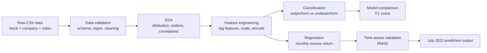

# Index Return Prediction Portfolio

<p align="center">
  
  
  
  
</p>

Predicting whether US stocks outperform an index and estimating monthly excess return from historical price, volume, company profile, and optional macroeconomic features.

---

## Executive Summary

This project demonstrates an end-to-end financial machine learning workflow: data loading, data validation, exploratory analysis, feature engineering, classification, regression, and inference preparation. The classification task predicts whether a stock will outperform the index, while the regression task estimates excess return. The workflow compares simple linear models against tree-based methods and uses time-aware validation for return forecasting to reduce look-ahead bias.

The strongest results show **Random Forest classification F1 around 0.89** and **tree-based regression RMSE around 0.033–0.034**, with Lasso/Ridge used as interpretable baselines. 

---

## Workflow



---

## Key Features

- Data quality checks for `stock_id`, `month_id`, missing values, and outliers.
- Exploratory analysis using candlestick, distribution, and correlation visuals.
- Feature preparation with one-hot encoding, scaling, log transforms, and lagged return/volatility features.
- Classification model comparison: Logistic Regression, Random Forest, SVM, KNN, and Naive Bayes.
- Regression model comparison: Linear Regression, Ridge, Lasso, SVR, Random Forest, and Gradient Boosting.
- TimeSeriesSplit validation for regression to better reflect forecasting constraints.
- Static interactive portfolio page for GitHub Pages deployment.

---

## Main Results from Notebook

| Task | Best / Highlight Model | Metric | Result |
|---|---:|---:|---:|
| Classification | Random Forest | F1 score | ~0.893–0.898 |
| Classification baseline | Logistic Regression | F1 score | ~0.655, full model ~0.810 |
| Regression | Random Forest Regressor | CV RMSE | ~0.0334 |
| Regression | Gradient Boosting Regressor | CV RMSE | ~0.0343 |
| Regression baseline | Lasso / Ridge | RMSE / CV RMSE | ~0.0316–0.0403 |

> Note: this is a learning/portfolio project, not an investment recommendation system.

---

## Repository Structure

```text
index-return-prediction-portfolio/
├── README.md
├── LICENSE
├── .gitignore
├── requirements.txt
├── GITHUB_SETUP.md
├── notebooks/
│   └── 01_index_return_prediction.ipynb
├── src/
    └── index_return_pipeline.py
```

---

## Dataset Inputs

```text
company_info.csv
index.csv
stock_data.csv
training_targets.csv
testing_targets.csv
fed funds rate.csv                  
fed inflation rate.csv              
fed unemployment rate.csv           
us 5 year treasury.csv              
us 10 year treasury.csv             
vix index.csv                       
```

---

## Getting Started

```bash
git clone https://github.com/<your-username>/index-return-prediction-portfolio.git
cd index-return-prediction-portfolio
python -m venv .venv
source .venv/bin/activate  # Windows: .venv\Scripts\activate
pip install -r requirements.txt
```

Run the notebook:

```bash
jupyter lab notebooks/01_index_return_prediction.ipynb
```

Run the pipeline after load CSVs:

```bash
python src/index_return_pipeline.py --data-dir data/raw --output-dir outputs
```

---

## Tech Stack

Python · pandas · NumPy · scikit-learn · matplotlib · seaborn · mplfinance 

---

## Limitations

- The uploaded material contains the notebook only; raw CSV data is not included in this packaged repository.
- Some exploratory notebook cells include draft/experimental attempts; the reusable script focuses on the clean portfolio workflow.
- Financial return prediction is noisy and should be evaluated with strict time-aware validation before operational use.
- Results are from the notebook outputs and should be revalidated when the dataset or feature logic changes.
